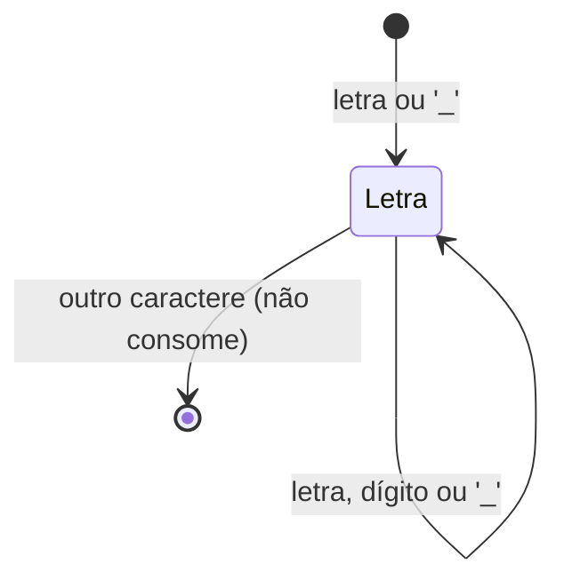
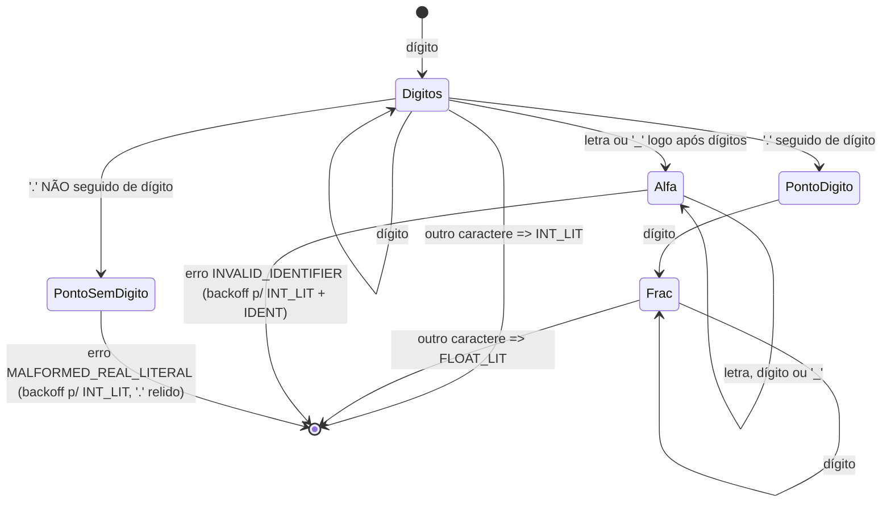
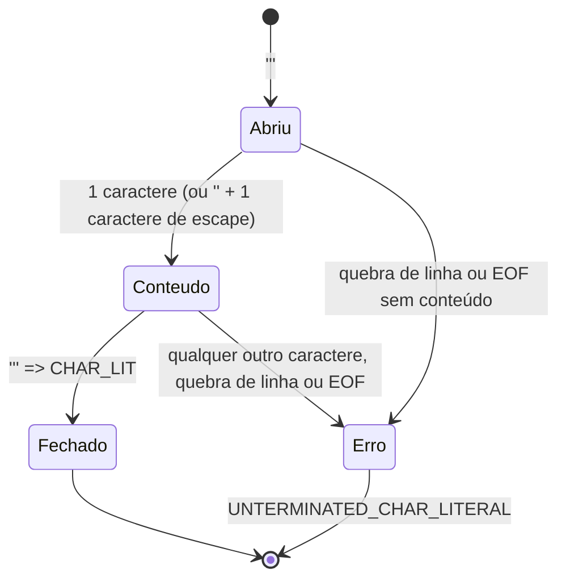
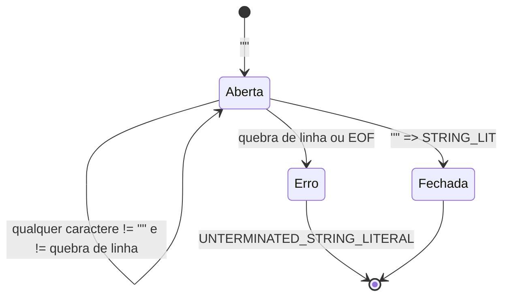
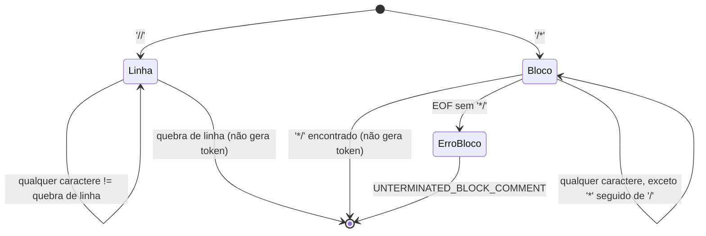

# Especificação léxica da MINIC

Este documento cobre os itens **b (parcial, apenas o que afeta o léxico)**,
e principalmente os passos **01, 02 e 03** do checklist da Etapa 1
(definir tokens, escrever padrões, desenhar autômatos).

Esta especificação é implementada duas vezes, com o mesmo comportamento:
`src/scanner.py` (Python) e `src/scanner.c` (C). Os autômatos abaixo
descrevem a lógica comum às duas implementações.

## 1. Alfabeto e categorias de tokens

| Categoria | Tokens |
|---|---|
| Palavras reservadas | `INT FLOAT BOOL CHAR VOID IF ELSE WHILE FOR RETURN BREAK CONTINUE TRUE FALSE PRINT READ` |
| Identificador | `IDENT` |
| Literais | `INT_LIT FLOAT_LIT CHAR_LIT STRING_LIT` |
| Operadores aritméticos | `PLUS(+) MINUS(-) STAR(*) SLASH(/) PERCENT(%)` |
| Operadores relacionais | `LT(<) LE(<=) GT(>) GE(>=) EQ(==) NEQ(!=)` |
| Operadores lógicos | `AND(&&) OR(\|\|) NOT(!)` |
| Atribuição | `ASSIGN(=)` |
| Delimitadores | `LPAREN( ) RPAREN( ) LBRACKET([) RBRACKET(]) LBRACE({) RBRACE(}) COMMA(,) SEMICOLON(;) DOT(.)` |
| Especial | `EOF` |

## 2. Padrões (expressões regulares)

```
IDENT      = [A-Za-z_][A-Za-z0-9_]*        (se pertencer a RESERVED, vira a palavra reservada)
INT_LIT    = [0-9]+
FLOAT_LIT  = [0-9]+ '.' [0-9]+
CHAR_LIT   = ''' ( [^'\n\\] | '\' . ) '''
STRING_LIT = '"' ( [^"\n\\] | '\' . )* '"'
comentário-linha  = '//' [^\n]*
comentário-bloco  = '/*' .*? '*/'            (não aninhado; usa o menor fechamento)
```

Operadores de dois caracteres têm **prioridade sobre os de um caractere**
(maximal munch): `==`, `!=`, `<=`, `>=`, `&&`, `||` são sempre lidos por
inteiro antes de se considerar `=`, `!`, `<`, `>`, `&` ou `|` isolados.

## 3. Autômatos dos principais reconhecedores

### 3.1 Identificador / palavra reservada



Ao aceitar, o lexema é comparado à tabela de palavras reservadas; se não
houver correspondência, o token é `IDENT` e o atributo é o próprio lexema.

### 3.2 Número (inteiro / real / real malformado)



### 3.3 Literal de caractere



### 3.4 Literal de cadeia (string)



### 3.5 Comentários



## 4. Diagnósticos de erro e estratégia de recuperação

O scanner **não para no primeiro erro**: ele registra o diagnóstico e tenta
continuar produzindo tokens válidos depois dele, sempre que isso for
razoável. A estratégia é específica por tipo de erro (documentada e testada
em `testes/casos-invalidos`):

| Erro | Quando ocorre | O que é reportado | Recuperação |
|---|---|---|---|
| `UNKNOWN_SYMBOL` | caractere que não inicia nenhum token válido (ex.: `@`) | o próprio caractere | descarta 1 caractere e continua |
| `UNTERMINATED_BLOCK_COMMENT` | `/*` sem `*/` correspondente | trecho de `/*` até o EOF | não há mais o que ler (fim do arquivo) |
| `UNTERMINATED_CHAR_LITERAL` | `'` sem fechamento correto | `'` + conteúdo lido | descarta também o caractere que deveria ser o fechamento |
| `UNTERMINATED_STRING_LITERAL` | `"` sem fechamento antes da quebra de linha | conteúdo até o fim da linha (para contexto) | volta até o primeiro delimitador/operador reconhecido na linha, que volta a ser tokenizado normalmente |
| `MALFORMED_REAL_LITERAL` | dígitos seguidos de `.` sem dígito depois (ex. `12.`) | dígitos + `.` | *backoff*: emite `INT_LIT` com os dígitos; o `.` é relido como `DOT` |
| `INVALID_IDENTIFIER` | dígitos seguidos imediatamente de letra/`_` (ex. `123abc`) | o lexema completo | *backoff*: separa em `INT_LIT` (prefixo numérico) + `IDENT`/palavra reservada (sufixo) |
| `INCOMPLETE_LOGICAL_OPERATOR` | `&` ou `\|` isolado (não seguido do mesmo caractere) | o caractere isolado | descarta 1 caractere e continua |

Essa tabela responde diretamente à pergunta do checklist "a mensagem
permite localizar e corrigir?": cada diagnóstico traz `linha`, `coluna` e o
`lexema` exato que causou o problema, então o usuário sabe **onde** e **o
quê** corrigir.

> Observação sobre `UNTERMINATED_STRING_LITERAL`: o texto do diagnóstico
> mostra a linha inteira até seu fim (para dar contexto de leitura ao
> usuário), mas a recuperação some apenas com o trecho textual (letras,
> dígitos, espaços); pontuação reconhecida pela linguagem (como `)` `;`)
> não é engolida pelo erro e volta a virar token normalmente. Essa escolha
> foi validada em `testes/casos-invalidos/i04_cadeia_nao_terminada.*`.
